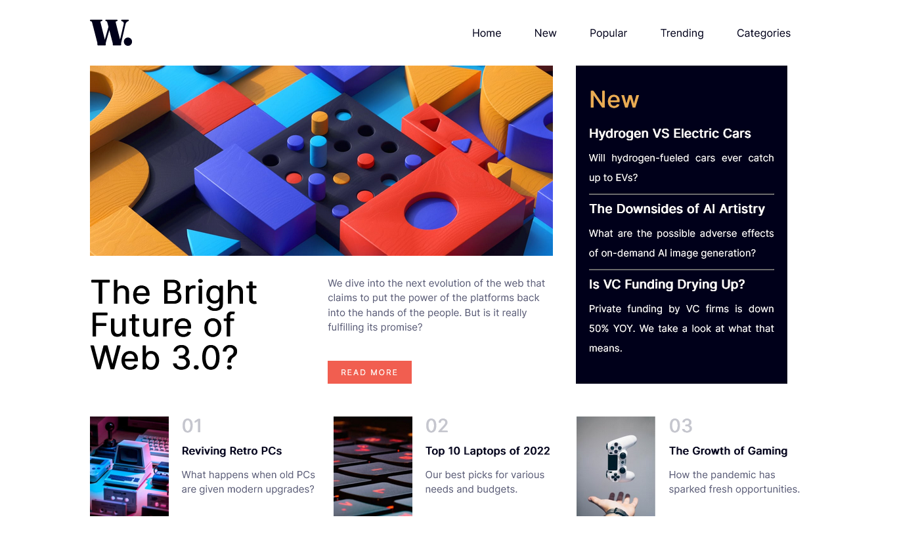

# Frontend Mentor - News homepage solution

This is a solution to the [News homepage challenge on Frontend Mentor](https://www.frontendmentor.io/challenges/news-homepage-H6SWTa1MFl). Frontend Mentor challenges help you improve your coding skills by building realistic projects. 

## Table of contents

- [Overview](#overview)
  - [The challenge](#the-challenge)
  - [Screenshot](#screenshot)
  - [Links](#links)
- [My process](#my-process)
  - [Built with](#built-with)
  - [What I learned](#what-i-learned)
- [Author](#author)

## Overview

Simple Homepage for Gadgets

### The challenge

Users should be able to:

- View the optimal layout for the interface depending on their device's screen size
- See hover and focus states for all interactive elements on the page

### Screenshot

### Links

- Live Site URL: (https://ayodaniel6.github.io/HomePage/home.html)

## My process

### Built with

- Semantic HTML5 markup
- CSS custom properties
- Flexbox
- CSS Grid

### What I learned

Just starting JavaScript and this challange push me in gaining the basics in DOM

## Author

- Website - [Daniel](https://github.com/ayodaniel6)
- Frontend Mentor - [@ayodaniel6](https://www.frontendmentor.io/profile/ayodaniel6)
- Twitter - [@ayo_daniel6](https://www.twitter.com/ayo_daniel6)
